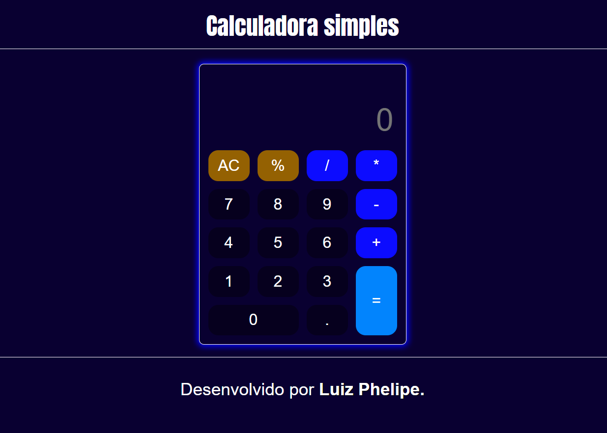
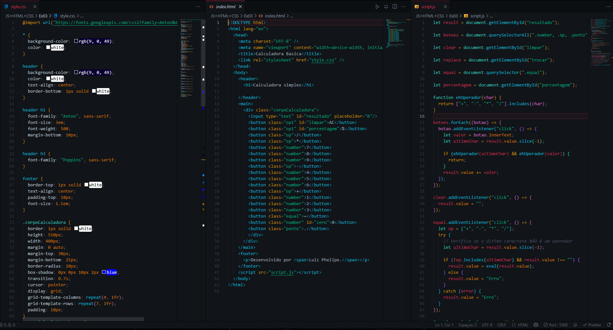

# 📱 Calculadora Simples

Projeto de uma calculadora básica feita com **HTML**, **CSS** e **JavaScript**, desenvolvida como parte do meu processo de aprendizado em desenvolvimento web.

## 🔧 Funcionalidades

- Operações básicas: adição, subtração, multiplicação e divisão
- Tecla AC para limpar a tela
- Suporte a ponto decimal
- Prevenção de operadores duplicados
- Cálculo de porcentagem
- Estilo visual com `hover` e responsividade leve

## 🎯 Tecnologias Utilizadas

- HTML5
- CSS3 (com Grid Layout)
- JavaScript Puro (Vanilla JS)

## 💻 Demonstração

Acesse o projeto online aqui:  
👉 [Clique para abrir](https://SEU-USUARIO.github.io/calculadora)

## 📸 Screenshot

## 🧠 Aprendizados

Durante o desenvolvimento, pratiquei:

- Manipulação do DOM
- Eventos de clique
- Validação de operadores
- Funções matemáticas com `eval()`
- Estruturação de layout com CSS Grid

## 👤 Autor

Desenvolvido por Luiz Phelipe.  
Me acompanhe no [LinkedIn](www.linkedin.com/in/luiz-phelipe-80a1932b0)

---
